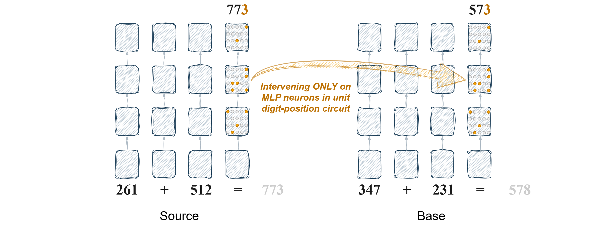

## 'Modular Arithmetic: Language Models Solve Math Digit by Digit'
### Data and Code for the paper 'Modular Arithmetic: Language Models Solve Math Digit by Digit'

This repository provides a Jupyter notebook to reproduce the main result from the paper: Intervening on MLP subspaces corresponding to specific digit-position circuits selectively alters the output at the targeted digit position.

*Figure 1: Intervention at digit-position-specific arithmetic circuits exclusively alters the output at the targeted digit*

Details are in the *Digit_Circuit_Intervention.ipynb* script. 
